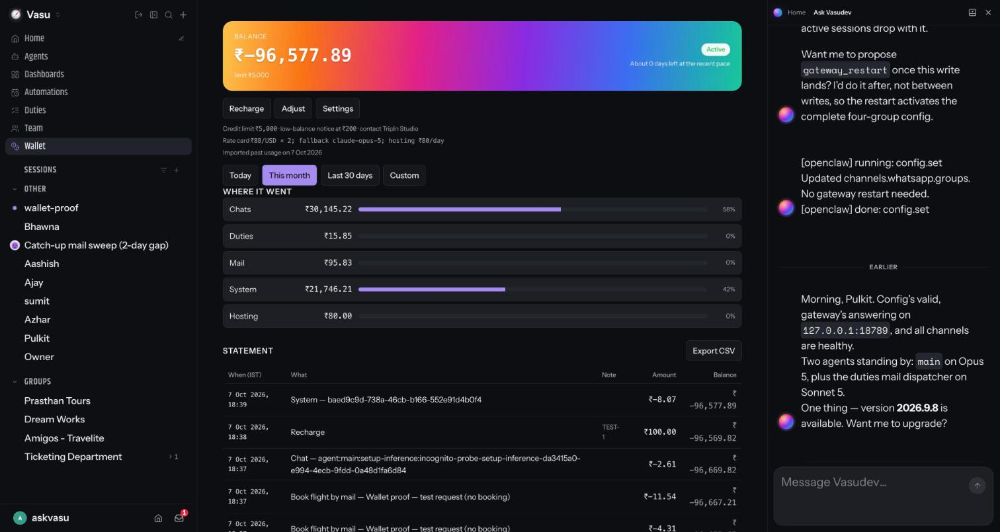

# Wallet — live proof on Amigos (Task 13)

Desk: `vasudev-amigos` (DigitalOcean blr1, 4 GB). Branch `staging/team-v2-test`. Everything here is
redacted: no tokens, passwords, or customer message bodies. Roster ids and amounts are the real ones
on that desk because they are the thing being proved.

Owner decisions carried into this proof (2026-10-07): backfill every token used so far, let the
balance go negative, then set a ₹5,000 credit limit over the negative balance and turn enforcement on.
Owner ruling during the proof (chat, 2026-10-07): **Amigos must not pause.** Enforcement stays off on
Amigos for the whole proof and afterwards; the exhaustion step is not run there (the block path is covered
by the plugin's unit tests). The ₹5,000 credit limit is set for display only.

## Roll

| Attempt | Ref | Result |
| --- | --- | --- |
| 1 | `40c278d297` | **Failed at `pnpm install`**: the new `extensions/wallet` workspace package had no importer entry in `pnpm-lock.yaml`, so the frozen install refused the branch. `roll-remote.sh` restored the previous build (`a5bf32f596`) and the Gateway came back healthy (`/healthz` 200, NRestarts 0). |
| 2 | `bdb76aa5e8` (lockfile entry for `extensions/wallet`) | **OK**: build ~4 min, Gateway back with 24 plugins incl. `wallet`, `/healthz` 200, NRestarts 0. Wallet opened at −₹80 (today's hosting row posts on first start), Active, enforce off, contact TripIn Studio, database at `~/.openclaw/plugins/wallet/wallet.sqlite`. |

## Blocker found before the backfill

`sessions.usage` caps its session list at 1,000, newest first; on Amigos that reaches back only to 3 October, so the one-time import would have silently dropped 21 September to 2 October (about 209 M of 660 M tokens). Verified that single-day windows with an `agentId` filter return complete per-model token classes in `aggregates.byModel` and the chat share in `aggregates.byChannel`. The backfill is being rewritten to import per (day, agent, model) from those aggregates; the import has not been run.

## Live meter gap (found at step 4)

With `bdb76aa5e8` serving, a controlled chat turn and the desk's 5-minute mail-watch cron turn both added
tokens to `sessions.usage` but produced no ledger row and no `unrecorded` count; with enforcement on,
limit 0 and balance −₹80 a turn was still answered, so neither `before_agent_run` nor `llm_output`
reached the wallet. Ruled out from source: usage key names, tool-discovery loads replacing the hook
runner (they pass `activate: false`), hook grants, registration order. Diagnostics added in
`aed2b9b2d4` (info line on registration and on each hook's first event). Roll 3 carried them and showed the hooks
registered but silent. Roll 4 (`94f1c92b86`) added a one-time hook inventory line in the claude-cli runner; on the
next turn it printed `before_agent_run=[-] llm_output=[-] before_prompt_build=[memory-core] … generationScope=true`.

**Root cause:** turns run under a plugin-runtime generation whose registry is a separate discovery-mode load when the
Gateway's active registry is not reusable, and hook resolution uses that registry alone. Hooks registered only in
`"full"` mode (the SDK doc's own pattern) never dispatch; plugins registering hooks in every mode masked it. Fix:
adopt typed hooks into the agent-run registry the way context engines and widget presenters already are.

## Rolls 3–5

| Attempt | Ref | Result |
| --- | --- | --- |
| 3 | `aed2b9b2d4` | OK. Added hook diagnostics; showed hooks registered but silent. |
| 4 | `94f1c92b86` | OK. Hook inventory line named the failing layer (generation registry without the wallet's hooks). |
| 5 | `208526b448` | OK. Hook adoption fix: inventory shows `llm_output=[wallet] before_agent_run=[wallet]`; gate and meter fired; first live debit Chat — Opus, ₹7.26 (2 in / 4 out / 81,425 cache read / 71 cache write). |

## Steps

1. Wallet opened at −₹80 (today's hosting row), state Active, `enforce` off — **done** (via `wallet.get`)
2. Backfill → `{ days: 17, agents: 2, failed: 0, paise: 9,648,290 }`; balance −₹96,570.16; buckets Chat ₹54,315 / System ₹41,978 / Mail ₹196 / Hosting ₹80. Per-IST-day reconciliation against `sessions.usage` `aggregates.daily`: difference 0 on all 17 days; 662,464,208 tokens on both sides — **done**
3. Settings: credit limit ₹5,000, low balance ₹200, enforce **off** (owner ruling); desk keeps working — **done**
4. One chat message, one Duty run to the options PDF, one heartbeat → three live rows with real token counts; the Duty's `ai` steps appear under the run — _pending_
5. ~~Exhaustion step~~ — **not run on Amigos** (owner: Amigos must not pause). Credit ₹100 `TEST-1` (note "wallet proof") landed as `Recharge` by `operator` with the owner role briefly on the operator's own number, so the recharge notice went there and not to the customer; the owner role was restored to Azhar and verified. A second credit with the same reference was refused (`duplicate reference: TEST-1`) — **done**. `/wallet` in chat is left for the owner to type from a roster channel.
6. `NRestarts` = 0, Gateway active, no `wallet:` warnings in the journal, `unrecorded` 0, `enforce` off, no `stoppedSince` — **done**.

## Control UI

Signed in through the front door as the Amigos admin; the Wallet page rendered the balance header, limit, rate card and backfill facts, the period bar, the five buckets with shares, and the statement with the live rows and the test recharge:

## Follow-ups recorded

- The host's setup-inference probe turn (`agent:main:setup-inference:incognito-probe-…`) bills as Chat; it should bill as System.
- The claude-cli hook inventory line fired on that isolated probe turn (side effects disabled); log it on the first turn with side effects enabled.
- Why the Gateway's active plugin registry was not reusable for agent runs on Amigos (reuse would have avoided the discovery-mode registry).
- Prabhat and Prasthan desks are not rolled; they carry the hook gap for full-mode-only hooks and the older WhatsApp crash bug until rolled.
